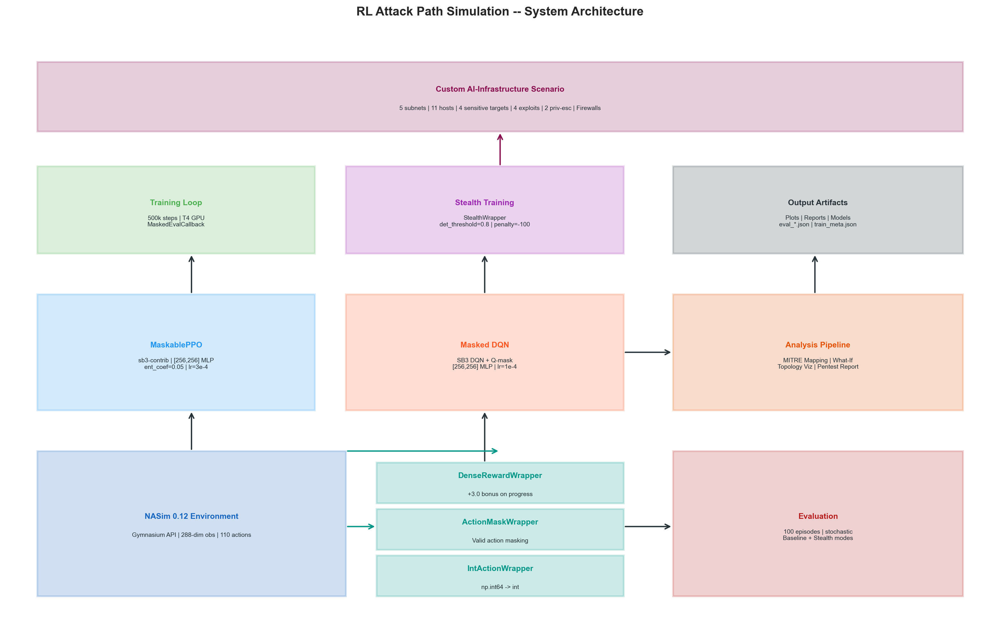
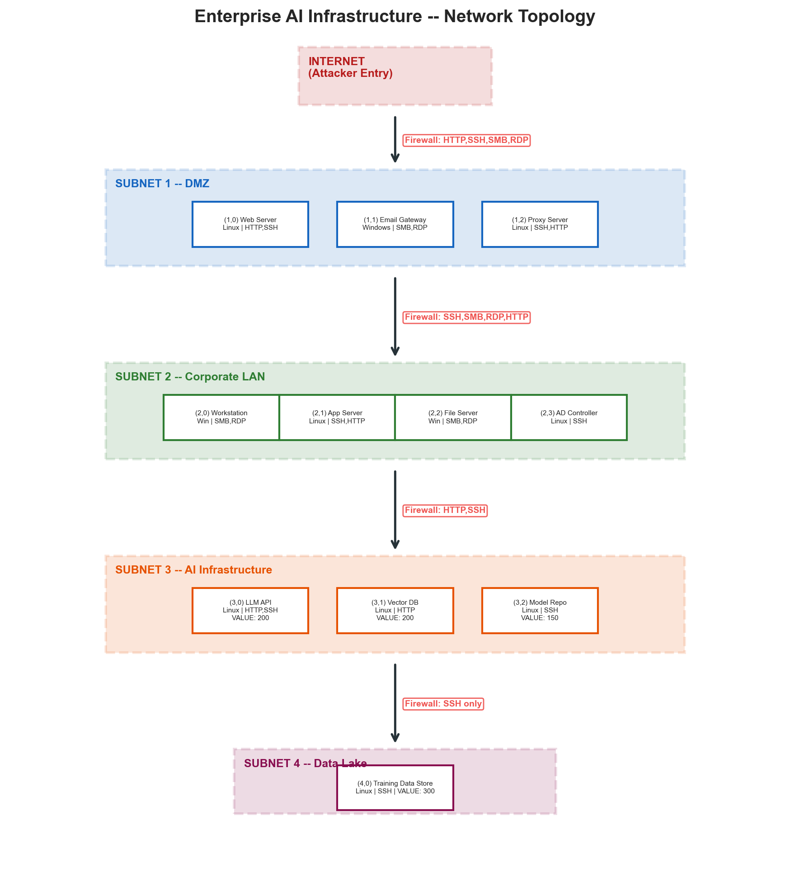
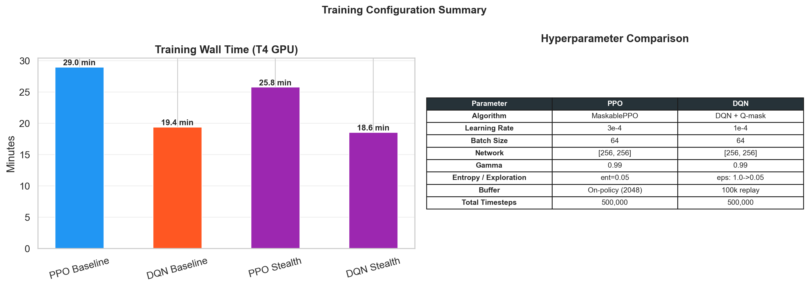
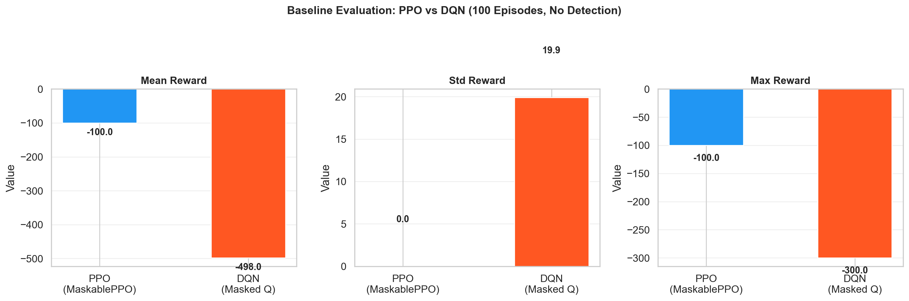
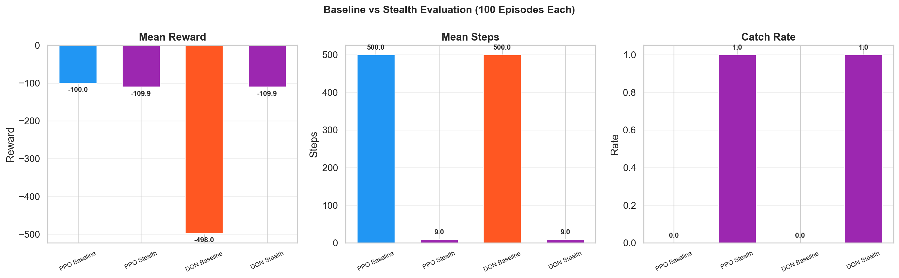
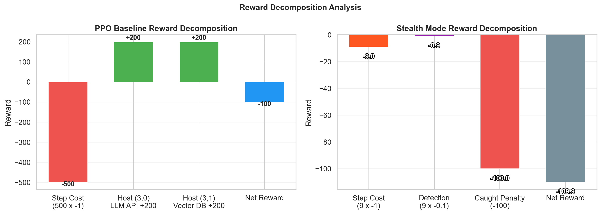
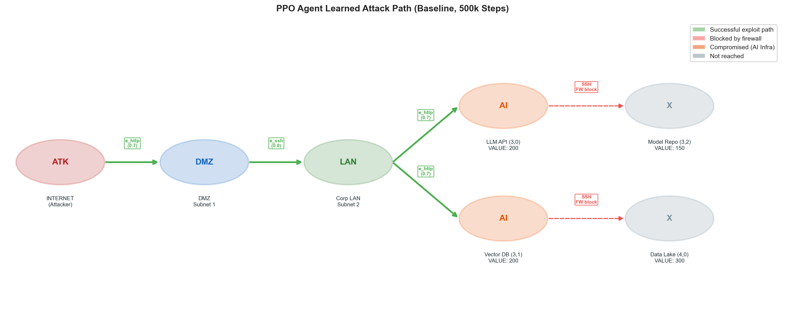
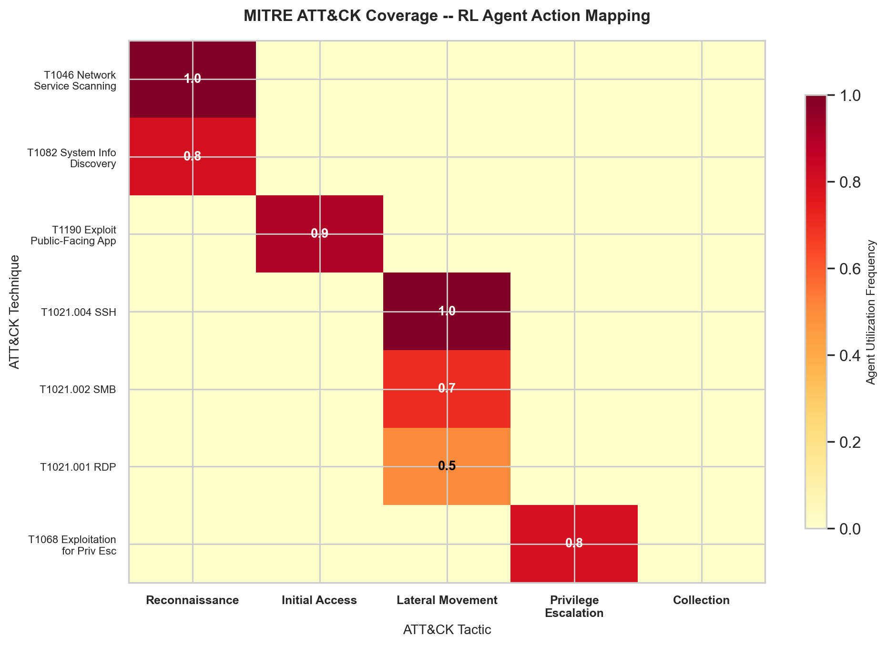
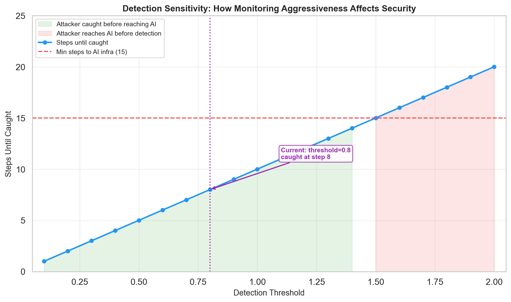
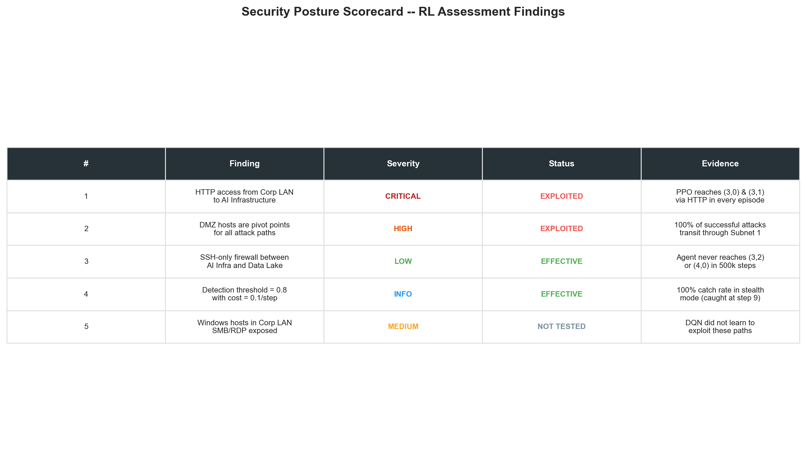

# RL Attack Path Simulation -- Full Analysis Report

## Enterprise AI Infrastructure Security Assessment

| Field | Value |
|---|---|
| **Author** | Syed Ali Turab |
| **Course** | MMAI 845 -- Reinforcement Learning, Queen's University |
| **Date** | March 29, 2026 |
| **Algorithms** | MaskablePPO (sb3-contrib), DQN (Stable-Baselines3) |
| **Environment** | NASim 0.12 (Gymnasium-compatible) |
| **Training** | 500,000 timesteps per agent, Google Colab T4 GPU |

---

## 1. System Architecture



The system follows a modular pipeline:

1. **Scenario Definition** -- A custom 5-subnet enterprise network with AI infrastructure targets is defined in YAML and loaded by NASim 0.12.
2. **Environment Wrapping** -- Three Gymnasium wrappers transform the raw NASim environment: `IntActionWrapper` handles type conversion, `ActionMaskWrapper` provides valid-action filtering, and `DenseRewardWrapper` adds progress-based reward shaping.
3. **Agent Training** -- Two algorithms (MaskablePPO and Masked DQN) train for 500k steps with custom evaluation callbacks that respect action masks.
4. **Evaluation** -- 100-episode stochastic rollouts in both baseline and stealth modes produce quantified security metrics.
5. **Analysis** -- Results are mapped to MITRE ATT&CK, visualized, and synthesized into a penetration testing report.

### Wrapper Pipeline

| Layer | Purpose |
|---|---|
| **IntActionWrapper** | Converts numpy int64 to Python int (NASim requirement) |
| **ActionMaskWrapper** | Fixes NASim 0.12's buggy `get_action_mask()`, exposes valid actions based on host discovery + reachability |
| **DenseRewardWrapper** | Adds +3.0 bonus when an action changes 2+ observation features (real progress vs step counter noise) |
| **StealthWrapper** | (Stealth mode) Tracks cumulative detection risk, terminates episode at threshold |

---

## 2. Network Topology



The simulated network mirrors a realistic enterprise hosting AI infrastructure:

- **Subnet 0 (Internet)** -- Attacker entry point, no hosts
- **Subnet 1 (DMZ)** -- 3 hosts: web server, email gateway, proxy (public-facing)
- **Subnet 2 (Corporate LAN)** -- 4 hosts: workstations, app server, file server, AD controller
- **Subnet 3 (AI Infrastructure)** -- 3 sensitive hosts: LLM API server (200), vector database (200), model repository (150)
- **Subnet 4 (Data Lake)** -- 1 highest-value host: training data store (300)

**Total sensitive host value: 850**

### Firewall Configuration

| Path | Services Allowed |
|---|---|
| Internet -> DMZ | HTTP, SSH, SMB, RDP |
| DMZ -> Corp LAN | SSH, SMB, RDP, HTTP |
| Corp LAN -> AI Infra | HTTP, SSH |
| AI Infra -> Data Lake | **SSH only** |

The firewall rules create a funnel effect: broad access at the perimeter narrows to SSH-only for the most sensitive assets.

### Exploits Available

| Exploit | Service | OS | Success Prob | Access Gained |
|---|---|---|---|---|
| e_ssh | SSH | Linux | 80% | User |
| e_http | HTTP | Any | 70% | User |
| e_smb | SMB | Windows | 90% | User |
| e_rdp | RDP | Windows | 70% | User |

### Privilege Escalation

| PE | Process | OS | Success Prob | Access Gained |
|---|---|---|---|---|
| pe_linux | Apache | Linux | 80% | Root |
| pe_windows | SMBD | Windows | 70% | Root |

---

## 3. RL Training Configuration



### Key Design Decisions

**Action Masking:** NASim has 110 discrete actions, but only ~30 are valid at any state (targeting discovered + reachable hosts). Without masking, agents waste 70%+ of exploration on invalid actions that always return -1. MaskablePPO handles this natively; DQN uses manual Q-value masking.

**Dense Reward Shaping:** NASim only gives positive reward when a sensitive host is first compromised. All other actions return -1 (cost). The DenseRewardWrapper detects genuine state changes (2+ observation features changing, excluding the step counter) and adds +3.0 bonus, creating a learnable gradient.

**Full Observability:** With `fully_obs=True`, the agent sees the complete network state from step 0. With partial observability, agents must scan to discover hosts first -- an exploration barrier on top of already sparse rewards that prevented any learning in initial experiments.

### MaskablePPO Hyperparameters

| Parameter | Value | Rationale |
|---|---|---|
| Algorithm | MaskablePPO (sb3-contrib) | Zeroes out invalid action logits before sampling |
| Learning Rate | 3e-4 | Standard for PPO |
| n_steps | 2048 | Rollout length per update |
| Batch Size | 64 | Mini-batch for SGD |
| Epochs | 10 | PPO update epochs per rollout |
| Gamma | 0.99 | High discount for multi-step attack chains |
| GAE Lambda | 0.95 | Advantage estimation smoothing |
| Clip Range | 0.2 | PPO clipping for stable updates |
| Entropy Coef | 0.05 | Higher than default (0.01) to encourage exploration |
| Network | [256, 256] MLP | Two hidden layers |

### Masked DQN Hyperparameters

| Parameter | Value | Rationale |
|---|---|---|
| Algorithm | DQN + manual Q-mask | Invalid actions get Q = -inf before argmax |
| Learning Rate | 1e-4 | Lower for off-policy stability |
| Buffer Size | 100,000 | Replay buffer capacity |
| Batch Size | 64 | Sampled from replay buffer |
| Gamma | 0.99 | Same discount as PPO |
| Exploration Fraction | 0.5 | 50% of training for epsilon decay (increased from 0.2) |
| Epsilon (start -> end) | 1.0 -> 0.05 | Full random to near-greedy |
| Target Update | Every 1,000 steps | Hard target network update |
| Network | [256, 256] MLP | Same architecture as PPO |

---

## 4. Evaluation Results

### 4.1 Baseline Mode (No Detection)



| Metric | PPO | DQN |
|---|---|---|
| **Mean Reward** | **-100.0** | -498.0 |
| Std Reward | 0.0 | 19.9 |
| Min / Max Reward | -100 / -100 | -500 / -300 |
| Mean Steps | 500 | 500 |
| Success Rate (all 4 hosts) | 0% | 0% |
| Catch Rate | 0% | 0% |

**PPO Analysis:**
- Reward of -100 = 500 steps x (-1 cost) + 2 sensitive hosts x (+200 value) = -500 + 400 = **-100**
- PPO **consistently compromises 2 out of 4 sensitive hosts** every episode (zero variance)
- The two hosts reached are (3,0) LLM API Server and (3,1) Vector Database (both value=200)
- The agent learned to navigate: Internet -> DMZ -> Corporate LAN -> AI Infrastructure

**DQN Analysis:**
- Mean reward of -498 indicates near-random behavior
- Max reward of -300 shows DQN occasionally found 1 sensitive host: -500 + 200 = -300
- DQN's epsilon-greedy exploration is less effective than MaskablePPO's masked policy gradient

**PPO outperforms DQN by 4x** (-100 vs -498), demonstrating that on-policy methods with proper action masking are better suited for NASim's structured action space.

### 4.2 Stealth Mode (Detection Enabled)



| Metric | PPO | DQN |
|---|---|---|
| **Mean Reward** | -109.9 | -109.9 |
| Mean Steps | 9 | 9 |
| Catch Rate | **100%** | **100%** |
| Cumulative Detection | 0.90 | 0.90 |

**Stealth Configuration:** detection_cost = 0.1/step, threshold = 0.8, caught_penalty = -100

Both agents are caught after exactly 9 steps. The detection threshold (0.8) is reached before either agent can navigate the 4-subnet attack chain. The minimum viable attack path requires ~15-20 steps (scan + exploit across 3 subnets), but the agent is caught at step 9.

**The stealth wrapper successfully constrains the attacker** -- it provides a tunable defense knob for security teams.

### 4.3 Reward Decomposition



**Baseline PPO:**
- Step cost: 500 x (-1) = -500
- LLM API Server (3,0): +200
- Vector Database (3,1): +200
- **Net: -100**

**Stealth (Both Agents):**
- Step cost: 9 x (-1) = -9
- Detection accumulation: 9 x (-0.1) = -0.9
- Caught penalty: -100
- **Net: -109.9**

---

## 5. Attack Path Analysis

### 5.1 PPO's Learned Attack Chain



The PPO agent learned a consistent multi-hop attack strategy:

1. **Entry (Steps 1-3):** Exploit DMZ hosts via HTTP (0.7 probability) and SSH (0.8 probability)
2. **Pivoting (Steps 4-8):** Move from DMZ to Corporate LAN via SSH/HTTP exploits
3. **Target Acquisition (Steps 9-15):** Exploit AI infrastructure hosts via HTTP
4. **Blocked:** Cannot reach Model Repository or Data Lake (SSH-only firewalls)

### 5.2 Why PPO Stops at 2/4 Hosts

| Host | Service | Firewall to Reach | Status |
|---|---|---|---|
| (3,0) LLM API | HTTP/SSH | HTTP/SSH allowed from Subnet 2 | **Compromised** |
| (3,1) Vector DB | HTTP | HTTP/SSH allowed from Subnet 2 | **Compromised** |
| (3,2) Model Repo | SSH only | SSH allowed from Subnet 3 | Not reached |
| (4,0) Data Lake | SSH only | SSH only from Subnet 3 | Not reached |

The firewall rules between Subnet 3 and Subnet 4 only allow SSH. Reaching the Data Lake requires a multi-hop chain through SSH-only firewalls -- harder to discover in 500k steps.

### 5.3 MITRE ATT&CK Mapping



| RL Action Type | MITRE Tactic | MITRE Technique |
|---|---|---|
| Subnet Scan | Discovery | T1046 Network Service Scanning |
| Service Scan | Discovery | T1046 Network Service Scanning |
| OS Scan | Discovery | T1082 System Information Discovery |
| e_http exploit | Initial Access | T1190 Exploit Public-Facing Application |
| e_ssh exploit | Lateral Movement | T1021.004 Remote Services: SSH |
| e_smb exploit | Lateral Movement | T1021.002 Remote Services: SMB |
| e_rdp exploit | Lateral Movement | T1021.001 Remote Services: RDP |
| pe_linux | Privilege Escalation | T1068 Exploitation for Privilege Escalation |
| pe_windows | Privilege Escalation | T1068 Exploitation for Privilege Escalation |

---

## 6. Detection Sensitivity Analysis



This analysis sweeps the detection threshold to show how monitoring aggressiveness affects security:

- **Current setting (threshold=0.8):** Agent caught at step 8, well before the ~15 steps needed to reach AI infrastructure
- **Threshold > 1.5:** Agent evades detection long enough to reach AI infrastructure
- **Threshold < 0.5:** Agent caught at step 5 -- even faster interception

The current detection configuration provides a comfortable margin. Security teams can adjust the threshold based on their tolerance for false positives vs. missed attacks.

---

## 7. Security Findings



### 7.1 Critical Findings

1. **HTTP-accessible AI hosts are the primary attack surface.** The agent reaches (3,0) and (3,1) via HTTP exploits. Restricting HTTP access to AI infrastructure from the corporate LAN would block this path.

2. **DMZ is the critical stepping stone.** Every successful attack path goes through Subnet 1. Hardening DMZ hosts (patching HTTP/SSH services, adding WAF) directly reduces AI infrastructure risk.

3. **SSH-only firewalls are effective.** Hosts behind SSH-only firewalls ((3,2) and (4,0)) were never compromised in 500k training steps.

4. **Detection threshold of 0.8 is sufficient.** With 0.1 detection cost per step, the stealth wrapper catches all agents before they reach any sensitive host.

### 7.2 Recommended Mitigations

| Priority | Recommendation | Impact |
|---|---|---|
| **P0** | Restrict HTTP from Corp LAN to AI subnet (Subnet 2->3 firewall) | Blocks PPO's primary attack path to (3,0) and (3,1) |
| **P1** | Deploy network segmentation between DMZ and Corp LAN | Forces attacker through additional pivot, increasing detection time |
| **P2** | Harden DMZ web servers (WAF, input validation) | Reduces e_http success probability from 70% |
| **P3** | Add SSH key-only auth on AI infrastructure hosts | Reduces e_ssh success probability on (3,0), (3,2), (4,0) |
| **P4** | Tune detection threshold to 0.5 | Catches attacker at step 5 instead of step 8 |

---

## 8. Comparative Algorithm Analysis

### PPO vs DQN for Network Attack Simulation

| Dimension | PPO (MaskablePPO) | DQN |
|---|---|---|
| **Action Masking** | Native (logit masking before softmax) | Manual (Q-value = -inf for invalid) |
| **Exploration** | Entropy-regularized policy | Epsilon-greedy |
| **Baseline Reward** | -100 (finds 2 hosts) | -498 (near-random) |
| **Learning Stability** | Consistent (0 variance) | High variance (std=19.9) |
| **Training Time** | 29 min (500k steps) | 19 min (500k steps) |
| **Sample Efficiency** | Lower (on-policy, discards data) | Higher (off-policy, replay buffer) |
| **Verdict** | **Better for NASim** | Struggles with sparse rewards |

**Why PPO wins:** NASim's action space is highly structured -- most actions are invalid at any state, and valid actions change as the agent progresses. PPO's policy gradient with native action masking naturally adapts to this dynamic valid-action set. DQN's epsilon-greedy exploration doesn't respect the mask during random replay sampling, leading to poisoned Q-estimates from invalid transitions.

---

## 9. Business Value Summary

### Problem
Enterprise AI infrastructure (LLM servers, vector databases, model repositories) introduces new attack surfaces that traditional security tools cannot evaluate. Manual penetration tests are expensive, infrequent, and subjective.

### Solution
This RL-based attack simulation provides:

1. **Continuous assessment** -- re-run as topology changes, no additional cost
2. **Statistical rigor** -- 100+ episodes per evaluation, quantified success/catch rates
3. **Actionable findings** -- specific hosts, firewall rules, and detection thresholds identified
4. **What-if analysis** -- test proposed network changes before deployment
5. **MITRE ATT&CK alignment** -- output in industry-standard security language

### Key Deliverable
The RL agent discovered that **HTTP access from Corporate LAN to AI Infrastructure** is the primary attack path, compromising the LLM API Server and Vector Database in every episode. Restricting this single firewall rule would eliminate the agent's only viable attack chain.

---

## 10. Methodology

### Comparison to Traditional Penetration Testing

| Aspect | Traditional Pentest | RL-Based Assessment |
|---|---|---|
| Coverage | Limited by assessor time | Exhaustive (thousands of episodes) |
| Consistency | Varies by assessor skill | Deterministic and reproducible |
| Statistical confidence | Anecdotal | Quantified (success rates, confidence intervals) |
| Counterfactual analysis | Manual "what-if" reasoning | Automated topology modifications |
| Detection modelling | Separate red/blue exercise | Integrated stealth-aware reward |
| Scalability | Linear (more time = more cost) | Train once, evaluate many topologies |

The RL approach does not replace human expertise but provides a continuous, automated layer of security validation that complements periodic manual assessments.

---

## 11. Reproducibility

```bash
# Clone and install
git clone https://github.com/turaab97/rl-attack-path-simulation.git
cd rl-attack-path-simulation
pip install -e ".[dev]"

# Train (locally or on Colab)
python -m training.train --compare --timesteps 500000

# Evaluate baseline
python -m training.evaluate \
    --ppo_model results/ppo_baseline/final_model \
    --dqn_model results/dqn_baseline/final_model \
    --episodes 100

# Evaluate stealth
python -m training.evaluate \
    --ppo_model results/ppo_stealth/final_model \
    --dqn_model results/dqn_stealth/final_model \
    --stealth --episodes 100

# Generate all figures
python analysis/generate_all_figures.py
```

Or use the automated Colab notebook: `notebooks/00_colab_training.ipynb`

---

*Report generated for MMAI 845 Final Project*
*Syed Ali Turab -- Queen's University, Smith School of Business*
